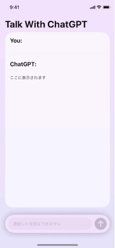
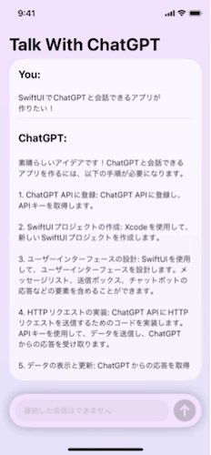
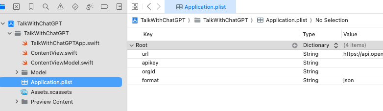

# TalkWithChatGPT

ChatGPTと話せるアプリ

# アプリの仕様

テキストフィールドに入力されたテキストを送信し、ChatGPTからのレスポンスを受け取るアプリ

## 短い会話の場合

## 長い会話の場合
scrollViewにしているので問題なく閲覧できる

# 開発環境

環境|バージョン
---|---
IDE| Xcode 15.0.1
Swift| Swift 5.9
ターゲットOS | iOS16.0以上
GPTバージョン | GPT3.5 Turbo

## API Keyなどについて
- API Key、Organization IDはOpenAIのサイトから取得してください
- 取得方法は[こちらのサイト](https://note.com/libproc/n/nc777ee0b3bf0)を参考にしました(参考にしたサイト等にも記載しています)
- **APIの無料枠があるか確認しましょう**(僕は$5支払いました...)
- Application.plistの**apiKeyにAPI Key**、**orgIdにOrganization ID**を入力すると使用できます
    

## 動作テスト済み機種
下記機種では動作の確認を行いました
機種名 | iOSバージョン
---|---
iPhoneXs | iOS 16.3
iPhone11Pro | iOS 17.0
iPhone15ProMax | iOS 17.1.1

# 参考にしたサイト等
これらのサイトや今までの課題アプリを参考に作成しました!
- [【Swift】swiftからChatGPT APIを使ってみる](https://thwork.net/2023/04/08/swift_chatgpt-api/)

- [[超初心者向け] ChatGPT(OpenAI)のAPI key取得手順](https://note.com/libproc/n/nc777ee0b3bf0)

- [OpenAI developer platform](https://platform.openai.com/docs/overview)

- [ChatGPT APIをSwiftで使ってみる。](https://qiita.com/district_13_bm/items/c946e8043e0e4d55d349)