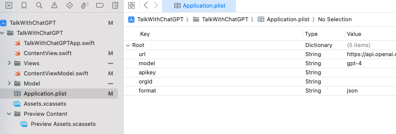

# TalkWithChatGPT
ChatGPTと話せるアプリ

# アプリの仕様
テキストフィールドに入力されたテキストを送信し、ChatGPTからのレスポンスを受け取るアプリ

## 動作
-  TextFieldからユーザーの入力を受け取る
-  OpenAIのAPIを使用してChatGPTへリクエストを送信する
-  受け取った情報をTextで表示する

## 短い会話の場合

## 長い会話の場合
scrollViewにしているので問題なく閲覧できる

## おまけ機能
テキストフィールドの横にある`・・・` のメニューの中にある

会話削除は使えるかな…？
- 会話削除

  

- 共有

  

# 開発環境
| 環境          | バージョン       |
| ------------- | ---------------- |
| IDE           | Xcode 15.0.1     |
| Swift         | Swift 5.9        |
| ターゲットOS  | iOS16.0以上      |
| GPTバージョン | GPT-4 (変更可能) |

## API Keyなどについて
- API Key、Organization IDはOpenAIのサイトから取得してください
- 取得方法は<a href="https://note.com/libproc/n/nc777ee0b3bf0" target="_blank">こちらのサイト</a>	を参考にしました([参考にしたサイト等](#参考にしたサイト等)にも記載しています)
- **APIの無料枠があるか確認しましょう**(僕は$5支払いました...)
- Application.plistの**apiKeyのValueにAPI Key**、**orgIdのValueにOrganization ID**を入力すると使用できます
- GPTのモデルを変更する場合は**modelのValue**を使いたいモデルにしましょう(例: gpt-3.5-turboやgpt-4など...)
- クソコードなのは許してください…
    

## 動作テスト済み機種
下記機種では動作の確認を行いました
| 機種名         | iOSバージョン |
| -------------- | ------------- |
| iPhoneXs       | iOS 16.3      |
| iPhone11Pro    | iOS 17.0      |
| iPhone15ProMax | iOS 17.1.1    |

# 今後改善したいポイント

- Markdownへの対応
- コードの可読性高上

# 参考にしたサイト等
これらのサイトや今までの課題アプリを参考に作成しました!

- <a href="https://thwork.net/2023/04/08/swift_chatgpt-api/" target="_blank">【Swift】swiftからChatGPT APIを使ってみる</a>	

- <a href="https://note.com/libproc/n/nc777ee0b3bf0" target="_blank">[超初心者向け] ChatGPT(OpenAI)のAPI key取得手順</a>	

- <a href="https://platform.openai.com/docs/overview" target="_blank">OpenAI developer platform</a>	

- <a href="https://zenn.dev/mjxo/articles/342adeec61d56e" target="_blank">ChatGPTのOpenAI APIを初回実行した際出会ったエラー3点</a>	

- <a href="https://qiita.com/district_13_bm/items/c946e8043e0e4d55d349" target="_blank">ChatGPT APIをSwiftで使ってみる。</a>

# ライセンスについて
MITライセンス内でご自由にお使いください
